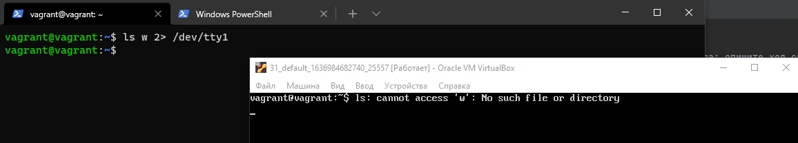
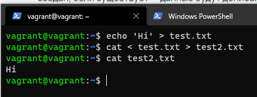
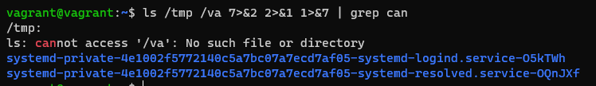
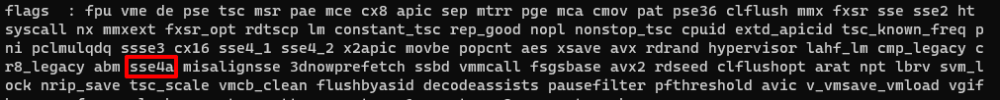
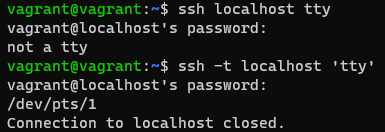

# Домашнее задание к занятию "3.2. Работа в терминале, лекция 2"

1. Какого типа команда `cd`? Попробуйте объяснить, почему она именно такого типа; опишите ход своих мыслей, если считаете что она могла бы быть другого типа.
> `cd is a shell builtin`. Для экономии ресурсов на использовании, не придется выполнять отдельный запуск программы.
2. Какая альтернатива без pipe команде `grep <some_string> <some_file> | wc -l`? `man grep` поможет в ответе на этот вопрос. Ознакомьтесь с [документом](http://www.smallo.ruhr.de/award.html) о других подобных некорректных вариантах использования pipe.
> `grep -c <some_string> <some_file>`
3. Какой процесс с PID `1` является родителем для всех процессов в вашей виртуальной машине Ubuntu 20.04?
> systemd
4. Как будет выглядеть команда, которая перенаправит вывод stderr `ls` на другую сессию терминала?
> 
5. Получится ли одновременно передать команде файл на stdin и вывести ее stdout в другой файл? Приведите работающий пример.
> 
6. Получится ли вывести находясь в графическом режиме данные из PTY в какой-либо из эмуляторов TTY? Сможете ли вы наблюдать выводимые данные?
> если правильно понимаю задание, то в пункте 4 как раз делал необходимый вывод
7. Выполните команду `bash 5>&1`. К чему она приведет? Что будет, если вы выполните `echo netology > /proc/$$/fd/5`? Почему так происходит?
> Предположение, что создали новый файловый дескриптор с выводом информации в дискриптор 1 (stdout).   
> Командой `echo netology > /proc/$$/fd/5` передали текст на 5 дискриптор, а 5 ссылается на 1. 
> Не нашел доступную статью про это, может бред пишу, извините..
8. Получится ли в качестве входного потока для pipe использовать только stderr команды, не потеряв при этом отображение stdout на pty? Напоминаем: по умолчанию через pipe передается только stdout команды слева от `|` на stdin команды справа.
Это можно сделать, поменяв стандартные потоки местами через промежуточный новый дескриптор, который вы научились создавать в предыдущем вопросе.
> 
9. Что выведет команда `cat /proc/$$/environ`? Как еще можно получить аналогичный по содержанию вывод?
> environ - среда пользователя. Среда пользователя представляет собой совокупность информации о пользователе, такой как его входной каталог, электронный почтовый ящик, тип терминала и т.д.  
> `env` - аналогичный вывод
10. Используя `man`, опишите что доступно по адресам `/proc/<PID>/cmdline`, `/proc/<PID>/exe`.
> `/proc/<PID>/cmdline` - если правильно понял man + выполнил cat, то содержит информацию, с помощью чего запускаются
> процессы через командную строку. В моем случае результат 'bash'.  
> `/proc/<PID>/exe` - символическая ссылка, содержащая актуальный путь к выполняемой команде. 
> Попробовал запустить `/proc/<PID>/exe`, запустился отдельный `<PID>`, при выполнении команд, теперь вместо bash - exe. 
> Попробовал прочитать `/proc/<PID>/cmdline`, он теперь содержит `/proc/<PID>/exe`. 
> Но практического применения не понял к сожалению из man.
11. Узнайте, какую наиболее старшую версию набора инструкций SSE поддерживает ваш процессор с помощью `/proc/cpuinfo`.
> 
12. При открытии нового окна терминала и `vagrant ssh` создается новая сессия и выделяется pty. Это можно подтвердить командой `tty`, которая упоминалась в лекции 3.2. Однако:

     ```bash
     vagrant@netology1:~$ ssh localhost 'tty'
     not a tty
     ```

     Почитайте, почему так происходит, и как изменить поведение.
> По умолчанию, когда используется запуск команды на удаленном компьютере с помощью ssh, TTY не запускается для удаленного сеанса.
> Можно добавить опцию -t, тогда запускается псевдо-терминал.   
> 
13. Бывает, что есть необходимость переместить запущенный процесс из одной сессии в другую. Попробуйте сделать это, воспользовавшись `reptyr`. Например, так можно перенести в `screen` процесс, который вы запустили по ошибке в обычной SSH-сессии.
> Попрактиковался со `screen` и `reptyr`. `reptyr` по умолчанию не стоит, пришлось отдельно скачать. Переместить одну
> сессию в другую получилось только через sudo и использование опции -T `sudo reptyr -T <PID>`
14. `sudo echo string > /root/new_file` не даст выполнить перенаправление под обычным пользователем, так как перенаправлением занимается процесс shell'а, который запущен без `sudo` под вашим пользователем. Для решения данной проблемы можно использовать конструкцию `echo string | sudo tee /root/new_file`. Узнайте что делает команда `tee` и почему в отличие от `sudo echo` команда с `sudo tee` будет работать.
> Команда `tee` в Linux нужна для записи вывода любой команды в один или несколько файлов.  
> Ответ, почему `sudo echo` не будет работать, в первом предложении задания. `sudo tee` после pipe запускается под пользователем
> root, имея доступ к директории /root/