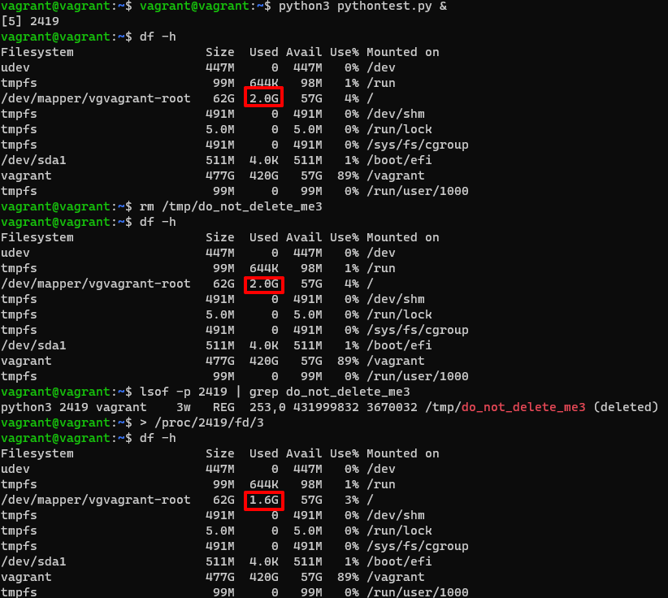
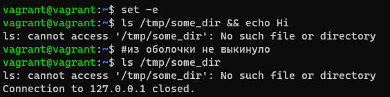
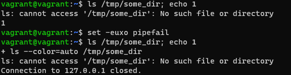

# Домашнее задание к занятию "3.3. Операционные системы, лекция 1"

1. Какой системный вызов делает команда `cd`? В прошлом ДЗ мы выяснили, что `cd` не является самостоятельной  программой, это `shell builtin`, поэтому запустить `strace` непосредственно на `cd` не получится. Тем не менее, вы можете запустить `strace` на `/bin/bash -c 'cd /tmp'`. В этом случае вы увидите полный список системных вызовов, которые делает сам `bash` при старте. Вам нужно найти тот единственный, который относится именно к `cd`.
> chdir("/tmp")                           = 0
2. Попробуйте использовать команду `file` на объекты разных типов на файловой системе. Например:
    ```bash
    vagrant@netology1:~$ file /dev/tty
    /dev/tty: character special (5/0)
    vagrant@netology1:~$ file /dev/sda
    /dev/sda: block special (8/0)
    vagrant@netology1:~$ file /bin/bash
    /bin/bash: ELF 64-bit LSB shared object, x86-64
    ```
    Используя `strace` выясните, где находится база данных `file` на основании которой она делает свои догадки.
> `/usr/share/misc/magic.mgc` - содержит необходимую информацию.  
> Часть из `strace`:
> ```
> stat("/home/vagrant/.magic.mgc", 0x7ffc7940d170) = -1 ENOENT (No such file or directory)
> stat("/home/vagrant/.magic", 0x7ffc7940d170) = -1 ENOENT (No such file or directory)
> openat(AT_FDCWD, "/etc/magic.mgc", O_RDONLY) = -1 ENOENT (No such file or directory)
> stat("/etc/magic", {st_mode=S_IFREG|0644, st_size=111, ...}) = 0
> ...
> openat(AT_FDCWD, "/usr/share/misc/magic.mgc", O_RDONLY) = 3
> ```
> Сначала попробовал прочитать:
> ```bash
> vagrant@vagrant:~$ cat /etc/magic
> # Magic local data for file(1) command.
> # Insert here your local magic data. Format is described in magic(5).
> ```
> Можно получается свое определение формата добавить. Дальше поиск уже пошел в `/usr/share/misc/magic.mgc`
3. Предположим, приложение пишет лог в текстовый файл. Этот файл оказался удален (deleted в lsof), однако возможности сигналом сказать приложению переоткрыть файлы или просто перезапустить приложение – нет. Так как приложение продолжает писать в удаленный файл, место на диске постепенно заканчивается. Основываясь на знаниях о перенаправлении потоков предложите способ обнуления открытого удаленного файла (чтобы освободить место на файловой системе).
> 
4. Занимают ли зомби-процессы какие-то ресурсы в ОС (CPU, RAM, IO)?
> Нет
5. В iovisor BCC есть утилита `opensnoop`:
    ```bash
    root@vagrant:~# dpkg -L bpfcc-tools | grep sbin/opensnoop
    /usr/sbin/opensnoop-bpfcc
    ```
    На какие файлы вы увидели вызовы группы `open` за первую секунду работы утилиты? Воспользуйтесь пакетом `bpfcc-tools` для Ubuntu 20.04. Дополнительные [сведения по установке](https://github.com/iovisor/bcc/blob/master/INSTALL.md).
> ```bash
> vagrant@vagrant:~$ strace -e trace=openat dpkg -L bpfcc-tools | grep sbin/opensnoop
> openat(AT_FDCWD, "/etc/ld.so.cache", O_RDONLY|O_CLOEXEC) = 3
> openat(AT_FDCWD, "/lib/x86_64-linux-gnu/libselinux.so.1", O_RDONLY|O_CLOEXEC) = 3
> openat(AT_FDCWD, "/lib/x86_64-linux-gnu/libc.so.6", O_RDONLY|O_CLOEXEC) = 3
> openat(AT_FDCWD, "/lib/x86_64-linux-gnu/libpcre2-8.so.0", O_RDONLY|O_CLOEXEC) = 3
> openat(AT_FDCWD, "/lib/x86_64-linux-gnu/libdl.so.2", O_RDONLY|O_CLOEXEC) = 3
> openat(AT_FDCWD, "/lib/x86_64-linux-gnu/libpthread.so.0", O_RDONLY|O_CLOEXEC) = 3
> openat(AT_FDCWD, "/proc/filesystems", O_RDONLY|O_CLOEXEC) = 3
> openat(AT_FDCWD, "/usr/lib/locale/locale-archive", O_RDONLY|O_CLOEXEC) = 3
> openat(AT_FDCWD, "/etc/dpkg/dpkg.cfg.d", O_RDONLY|O_NONBLOCK|O_CLOEXEC|O_DIRECTORY) = 3
> openat(AT_FDCWD, "/etc/dpkg/dpkg.cfg.d/excludes", O_RDONLY) = 3
> openat(AT_FDCWD, "/etc/dpkg/dpkg.cfg", O_RDONLY) = 3
> openat(AT_FDCWD, "/home/vagrant/.dpkg.cfg", O_RDONLY) = -1 ENOENT (No such file or directory)
> openat(AT_FDCWD, "/etc/ld.so.cache", O_RDONLY|O_CLOEXEC) = 3
> openat(AT_FDCWD, "/lib/x86_64-linux-gnu/libc.so.6", O_RDONLY|O_CLOEXEC) = 3
> openat(AT_FDCWD, "/usr/lib/locale/locale-archive", O_RDONLY|O_CLOEXEC) = 3
> openat(AT_FDCWD, "/var/lib/dpkg/arch", O_RDONLY) = 3
> openat(AT_FDCWD, "/var/lib/dpkg/status", O_RDONLY) = 3
> openat(AT_FDCWD, "/var/lib/dpkg/updates/", O_RDONLY|O_NONBLOCK|O_CLOEXEC|O_DIRECTORY) = 3
> openat(AT_FDCWD, "/var/lib/dpkg/triggers/File", O_RDONLY) = 3
> openat(AT_FDCWD, "/var/lib/dpkg/triggers/Unincorp", O_RDONLY) = 3
> openat(AT_FDCWD, "/var/lib/dpkg/info/format", O_RDONLY) = 4
> openat(AT_FDCWD, "/var/lib/dpkg/info/bpfcc-tools.list", O_RDONLY) = 4
> openat(AT_FDCWD, "/var/lib/dpkg/diversions", O_RDONLY) = 4
> /usr/sbin/opensnoop-bpfcc
> openat(AT_FDCWD, "/usr/share/locale/locale.alias", O_RDONLY|O_CLOEXEC) = 5
> openat(AT_FDCWD, "/usr/share/locale/en_US/LC_MESSAGES/dpkg.mo", O_RDONLY) = -1 ENOENT (No such file or directory)
> openat(AT_FDCWD, "/usr/share/locale/en/LC_MESSAGES/dpkg.mo", O_RDONLY) = -1 ENOENT (No such file or directory)
> openat(AT_FDCWD, "/usr/share/locale-langpack/en_US/LC_MESSAGES/dpkg.mo", O_RDONLY) = -1 ENOENT (No such file or directory)
> openat(AT_FDCWD, "/usr/share/locale-langpack/en/LC_MESSAGES/dpkg.mo", O_RDONLY) = -1 ENOENT (No such file or directory)
> +++ exited with 0 +++
> ```
6. Какой системный вызов использует `uname -a`? Приведите цитату из man по этому системному вызову, где описывается альтернативное местоположение в `/proc`, где можно узнать версию ядра и релиз ОС.
> Про какой системный вызов не понимаю вопроса. В `strace` нескролько различных системных вызовов.  
> Цитата из man:  
> /proc/version  
> This string identifies the kernel version that is currently running.  It includes the contents of /proc/sys/kernel/ostype, /proc/sys/kernel/osrelease and /proc/sys/kernel/version.
7. Чем отличается последовательность команд через `;` и через `&&` в bash? Например:
    ```bash
    root@netology1:~# test -d /tmp/some_dir; echo Hi
    Hi
    root@netology1:~# test -d /tmp/some_dir && echo Hi
    root@netology1:~#
    ```
    Есть ли смысл использовать в bash `&&`, если применить `set -e`?
> При использовании `;` сначала выполниться 1 команда `test -d /tmp/some_dir`, после ее завершения `echo Hi`  
> При использовании `&&`, вторая команда выполниться только при удачном завершении первой  
> 
> Использовать `&&` не имеет смысла с `set -e`, так как параметр `-e` указывает оболочке выйти, если команда дает 
> ненулевой статус выхода  
> Стал эксперемертировать с командой и смысл видимо есть, не выкидавыет из оболочки если используется `&&`, хотя 
> поди от задачи зависит, если цель при ошибке выйти, то не имеет смысла :)  
> 
8. Из каких опций состоит режим bash `set -euxo pipefail` и почему его хорошо было бы использовать в сценариях?
> Позволяет найти ошибку и завершить дальнейшее выполнение команд. Также все команды будут выведены на экран, включая ошибку.  
> 
9. Используя `-o stat` для `ps`, определите, какой наиболее часто встречающийся статус у процессов в системе. В `man ps` ознакомьтесь (`/PROCESS STATE CODES`) что значат дополнительные к основной заглавной буквы статуса процессов. Его можно не учитывать при расчете (считать S, Ss или Ssl равнозначными).
> `S` = 51, `I` = 48  
> дополнительные буквы/символы содержат доп информацию, например приоритет.