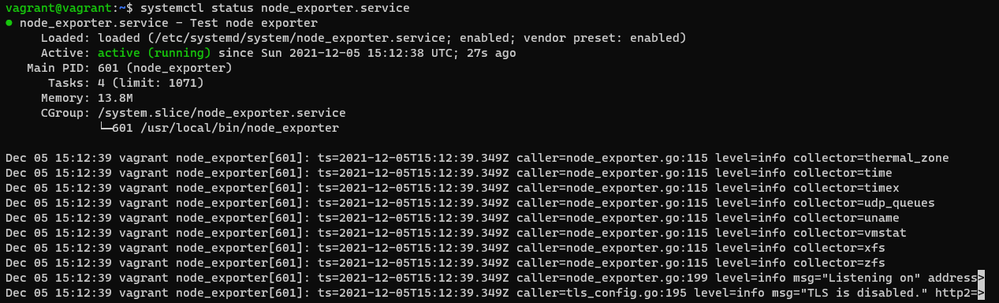
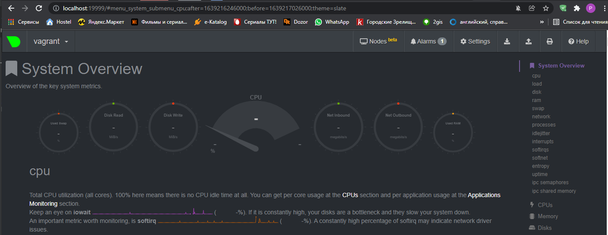
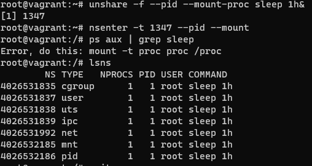

# Домашнее задание к занятию "3.4. Операционные системы, лекция 2"

1. На лекции мы познакомились с [node_exporter](https://github.com/prometheus/node_exporter/releases). В демонстрации его исполняемый файл запускался в background. Этого достаточно для демо, но не для настоящей production-системы, где процессы должны находиться под внешним управлением. Используя знания из лекции по systemd, создайте самостоятельно простой [unit-файл](https://www.freedesktop.org/software/systemd/man/systemd.service.html) для node_exporter:

    * поместите его в автозагрузку,
    * предусмотрите возможность добавления опций к запускаемому процессу через внешний файл (посмотрите, например, на `systemctl cat cron`),
    * удостоверьтесь, что с помощью systemctl процесс корректно стартует, завершается, а после перезагрузки автоматически поднимается.
> После перезапуска виртуалки:
> 
2. Ознакомьтесь с опциями node_exporter и выводом `/metrics` по-умолчанию. Приведите несколько опций, которые вы бы выбрали для базового мониторинга хоста по CPU, памяти, диску и сети.
> метрик очень много, пусть будут эти.  
> CPU:
> ```
> node_cpu_seconds_total{cpu="0",mode="idle"} 379612.3
> node_cpu_seconds_total{cpu="0",mode="iowait"} 0.76
> node_cpu_seconds_total{cpu="0",mode="irq"} 0
> node_cpu_seconds_total{cpu="0",mode="nice"} 0.1
> node_cpu_seconds_total{cpu="0",mode="softirq"} 3.09
> node_cpu_seconds_total{cpu="0",mode="steal"} 0
> node_cpu_seconds_total{cpu="0",mode="system"} 13.52
> node_cpu_seconds_total{cpu="0",mode="user"} 11.45
> node_cpu_seconds_total{cpu="1",mode="idle"} 379600.04
> node_cpu_seconds_total{cpu="1",mode="iowait"} 0.9
> node_cpu_seconds_total{cpu="1",mode="irq"} 0
> node_cpu_seconds_total{cpu="1",mode="nice"} 0.14
> node_cpu_seconds_total{cpu="1",mode="softirq"} 0.31
> node_cpu_seconds_total{cpu="1",mode="steal"} 0
> node_cpu_seconds_total{cpu="1",mode="system"} 16.51
> node_cpu_seconds_total{cpu="1",mode="user"} 4.49
> ```
> Память:
> ```
> node_memory_MemTotal_bytes 1.028694016e+09
> node_memory_MemFree_bytes 6.05376512e+08
> ```
> Диск:
> ```
> node_filesystem_free_bytes{device="/dev/mapper/vgvagrant-root",fstype="ext4",mountpoint="/"} 6.3995695104e+10
> node_filesystem_free_bytes{device="/dev/sda1",fstype="vfat",mountpoint="/boot/efi"} 5.35801856e+08
> node_filesystem_free_bytes{device="tmpfs",fstype="tmpfs",mountpoint="/run"} 1.02199296e+08
> node_filesystem_free_bytes{device="tmpfs",fstype="tmpfs",mountpoint="/run/lock"} 5.24288e+06
> node_filesystem_free_bytes{device="tmpfs",fstype="tmpfs",mountpoint="/run/user/1000"} 1.02866944e+08
> node_filesystem_free_bytes{device="vagrant",fstype="vboxsf",mountpoint="/vagrant"} 5.5917121536e+10
> ```
> Сеть:
> ```
> node_network_receive_bytes_total{device="eth0"} 2.128243e+06
> node_network_receive_bytes_total{device="lo"} 251220
> node_network_receive_errs_total{device="eth0"} 0
> node_network_receive_errs_total{device="lo"} 0
> ```
3. Установите в свою виртуальную машину [Netdata](https://github.com/netdata/netdata). Воспользуйтесь [готовыми пакетами](https://packagecloud.io/netdata/netdata/install) для установки (`sudo apt install -y netdata`). После успешной установки:
    * в конфигурационном файле `/etc/netdata/netdata.conf` в секции [web] замените значение с localhost на `bind to = 0.0.0.0`,
    * добавьте в Vagrantfile проброс порта Netdata на свой локальный компьютер и сделайте `vagrant reload`:

    ```bash
    config.vm.network "forwarded_port", guest: 19999, host: 19999
    ```

    После успешной перезагрузки в браузере *на своем ПК* (не в виртуальной машине) вы должны суметь зайти на `localhost:19999`. Ознакомьтесь с метриками, которые по умолчанию собираются Netdata и с комментариями, которые даны к этим метрикам.
> 
4. Можно ли по выводу `dmesg` понять, осознает ли ОС, что загружена не на настоящем оборудовании, а на системе виртуализации?
> Да можно по ключевым словам
> ```bash
> vagrant@vagrant:~$ dmesg | grep virt
> [    0.001790] CPU MTRRs all blank - virtualized system.
> [    0.062079] Booting paravirtualized kernel on KVM
> [    0.196681] Performance Events: PMU not available due to virtualization, using software events only.
> [    2.855344] systemd[1]: Detected virtualization oracle.
> ```
5. Как настроен sysctl `fs.nr_open` на системе по-умолчанию? Узнайте, что означает этот параметр. Какой другой существующий лимит не позволит достичь такого числа (`ulimit --help`)?
> по-умолчанию:
> ```bash
> vagrant@vagrant:~$ /sbin/sysctl -n fs.nr_open
> 1048576
>```
> Максимальное количество открытых дескрипторов файлов. Значение по умолчанию 1024*1024 (1048576)
> Другой лимит:
> ```bash
> vagrant@vagrant:~$ ulimit -n
> 1024 
> ```
6. Запустите любой долгоживущий процесс (не `ls`, который отработает мгновенно, а, например, `sleep 1h`) в отдельном неймспейсе процессов; покажите, что ваш процесс работает под PID 1 через `nsenter`. Для простоты работайте в данном задании под root (`sudo -i`). Под обычным пользователем требуются дополнительные опции (`--map-root-user`) и т.д.
> 
7. Найдите информацию о том, что такое `:(){ :|:& };:`. Запустите эту команду в своей виртуальной машине Vagrant с Ubuntu 20.04 (**это важно, поведение в других ОС не проверялось**). Некоторое время все будет "плохо", после чего (минуты) – ОС должна стабилизироваться. Вызов `dmesg` расскажет, какой механизм помог автоматической стабилизации. Как настроен этот механизм по-умолчанию, и как изменить число процессов, которое можно создать в сессии?
> Объявлена функция с наименованием `:`, которая порождает вызов самой себя 2 раза `:|:` в фоне `&`. После `;` вызов функции.  
> dmesg:
> `[Sun Dec 12 08:49:25 2021] cgroup: fork rejected by pids controller in /user.slice/user-1000.slice/session-4.scope`  
> Ограничил установкой лимита `ulimit -u 50`