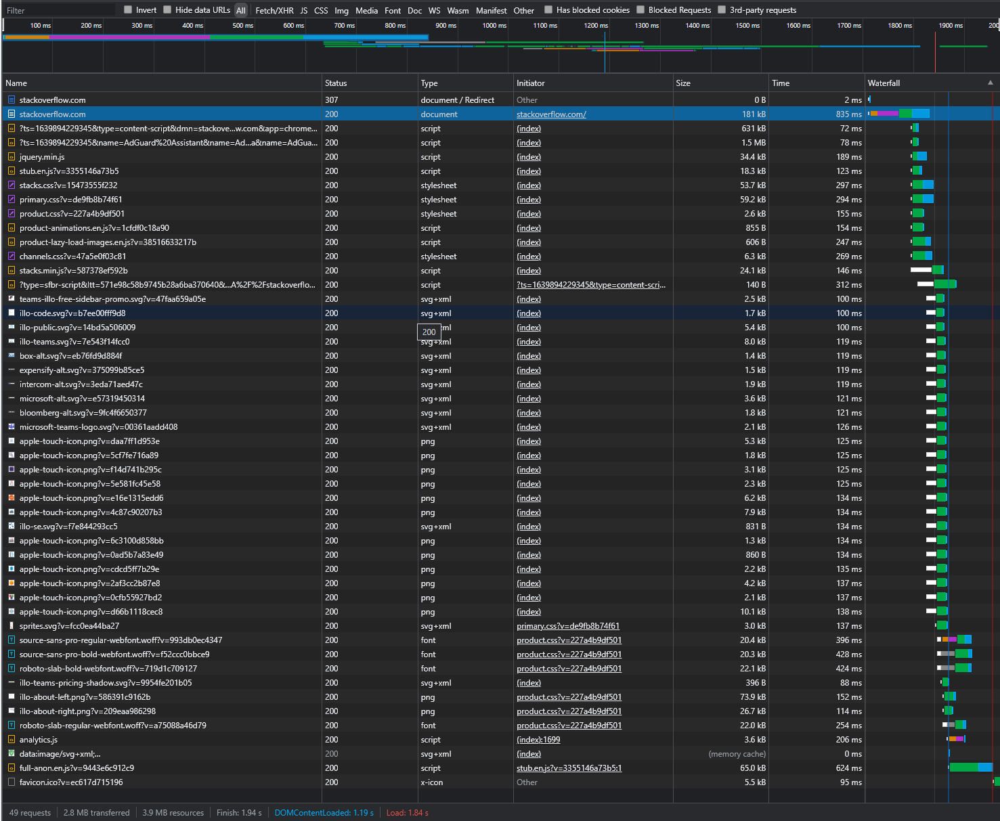
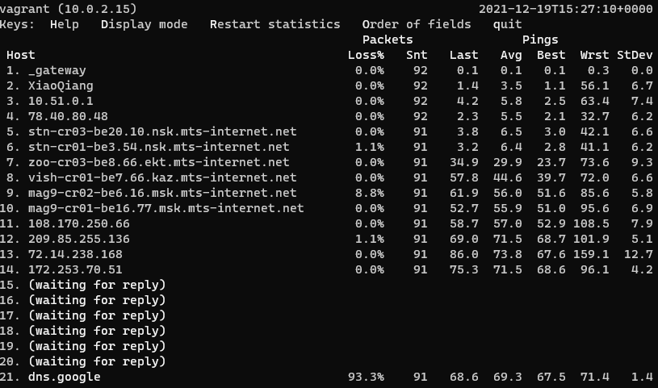

# Домашнее задание к занятию "3.6. Компьютерные сети, лекция 1"

1. Работа c HTTP через телнет.
- Подключитесь утилитой телнет к сайту stackoverflow.com
`telnet stackoverflow.com 80`
- отправьте HTTP запрос
```bash
GET /questions HTTP/1.0
HOST: stackoverflow.com
[press enter]
[press enter]
```
- В ответе укажите полученный HTTP код, что он означает?
> `301 Moved Permanently` - Код перенаправления "301 Moved Permanently" протокола передачи гипертекста (HTTP) показывает, 
> что запрошенный ресурс был окончательно перемещён в URL, указанный в заголовке Location (en-US). 
2. Повторите задание 1 в браузере, используя консоль разработчика F12.
- откройте вкладку `Network`
- отправьте запрос http://stackoverflow.com
- найдите первый ответ HTTP сервера, откройте вкладку `Headers`
- укажите в ответе полученный HTTP код.
- проверьте время загрузки страницы, какой запрос обрабатывался дольше всего?
- приложите скриншот консоли браузера в ответ.
> HTTP код = 307. Самый долгий вызов https://stackoverflow.com/ из-за этапа "Connection Start" в котором было шифрование
> 
3. Какой IP адрес у вас в интернете?
> 109.174.115.119 
4. Какому провайдеру принадлежит ваш IP адрес? Какой автономной системе AS? Воспользуйтесь утилитой `whois`
> Провайдер МТС (OJSC "MTS'" Broadband CGN). 
> AS30922
5. Через какие сети проходит пакет, отправленный с вашего компьютера на адрес 8.8.8.8? Через какие AS? Воспользуйтесь утилитой `traceroute`
> Отработало только с опцией I.  
> AS43318, AS8359 и AS15169
> ```bash
> vagrant@vagrant:~$ traceroute -IAn 8.8.8.8
> traceroute to 8.8.8.8 (8.8.8.8), 30 hops max, 60 byte packets
>  1  10.0.2.2 [*]  0.144 ms  0.068 ms  0.037 ms
>  2  192.168.31.1 [*]  1.570 ms  1.652 ms  1.625 ms
>  3  10.51.0.1 [*]  4.734 ms  8.098 ms  8.213 ms
>  4  78.40.80.48 [AS43318]  4.636 ms  4.995 ms  5.098 ms
>  5  195.34.36.57 [AS8359]  7.848 ms  7.935 ms  7.908 ms
>  6  195.34.50.188 [AS8359]  5.436 ms  2.818 ms  3.308 ms
>  7  212.188.42.149 [AS8359]  25.007 ms  28.395 ms  28.692 ms
>  8  212.188.29.85 [AS8359]  44.820 ms  46.693 ms  46.815 ms
>  9  195.34.50.161 [AS8359]  62.129 ms  64.036 ms  64.162 ms
> 10  212.188.29.82 [AS8359]  61.897 ms  62.025 ms  61.999 ms
> 11  108.170.250.66 [AS15169]  64.044 ms  64.016 ms  52.853 ms
> 12  209.85.255.136 [AS15169]  107.058 ms  107.208 ms  72.203 ms
> 13  72.14.238.168 [AS15169]  98.708 ms  101.120 ms  71.021 ms
> 14  172.253.70.51 [AS15169]  72.187 ms  73.288 ms  73.449 ms
> 15  * * *
> 16  * * *
> 17  * * *
> 18  * * *
> 19  * * *
> 20  * * *
> 21  * * *
> 22  * * *
> 23  * * *
> 24  8.8.8.8 [AS15169]  68.209 ms  68.415 ms  68.599 ms
> ```
6. Повторите задание 5 в утилите `mtr`. На каком участке наибольшая задержка - delay?
> Есть 3 ip адреса (12, 13 и 14 строки на скрине). За несколько запросов они менялись по средней задержке.  
> 
7. Какие DNS сервера отвечают за доменное имя dns.google? Какие A записи? воспользуйтесь утилитой `dig`
> 8.8.8.8 и 8.8.4.4
8. Проверьте PTR записи для IP адресов из задания 7. Какое доменное имя привязано к IP? воспользуйтесь утилитой `dig`  
В качестве ответов на вопросы можно приложите лог выполнения команд в консоли или скриншот полученных результатов.
> dns.google.
> ```bash
> vagrant@vagrant:~$ dig -x 8.8.8.8
> 
> ; <<>> DiG 9.16.1-Ubuntu <<>> -x 8.8.8.8
> ;; global options: +cmd
> ;; Got answer:
> ;; ->>HEADER<<- opcode: QUERY, status: NOERROR, id: 11345
> ;; flags: qr rd ra; QUERY: 1, ANSWER: 1, AUTHORITY: 0, ADDITIONAL: 1
> 
> ;; OPT PSEUDOSECTION:
> ; EDNS: version: 0, flags:; udp: 65494
> ;; QUESTION SECTION:
> ;8.8.8.8.in-addr.arpa.          IN      PTR
> 
> ;; ANSWER SECTION:
> 8.8.8.8.in-addr.arpa.   30      IN      PTR     dns.google.
> 
> ;; Query time: 0 msec
> ;; SERVER: 127.0.0.53#53(127.0.0.53)
> ;; WHEN: Sun Dec 19 15:41:53 UTC 2021
> ;; MSG SIZE  rcvd: 73
> 
> vagrant@vagrant:~$ dig -x 8.8.4.4
> 
> ; <<>> DiG 9.16.1-Ubuntu <<>> -x 8.8.4.4
> ;; global options: +cmd
> ;; Got answer:
> ;; ->>HEADER<<- opcode: QUERY, status: NOERROR, id: 57998
> ;; flags: qr rd ra; QUERY: 1, ANSWER: 1, AUTHORITY: 0, ADDITIONAL: 1
> 
> ;; OPT PSEUDOSECTION:
> ; EDNS: version: 0, flags:; udp: 65494
> ;; QUESTION SECTION:
> ;4.4.8.8.in-addr.arpa.          IN      PTR
> 
> ;; ANSWER SECTION:
> 4.4.8.8.in-addr.arpa.   30      IN      PTR     dns.google.
> 
> ;; Query time: 200 msec
> ;; SERVER: 127.0.0.53#53(127.0.0.53)
> ;; WHEN: Sun Dec 19 15:42:18 UTC 2021
> ;; MSG SIZE  rcvd: 73
> ```