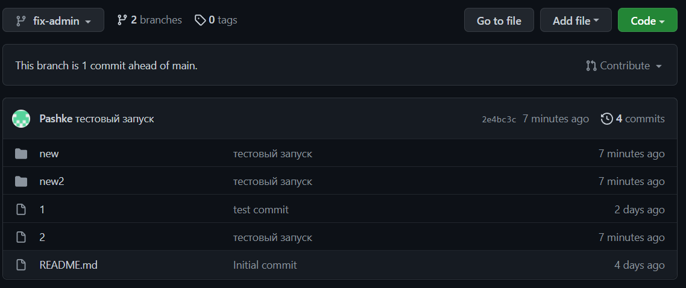

# Домашнее задание к занятию "4.2. Использование Python для решения типовых DevOps задач"

## Обязательная задача 1

Есть скрипт:
```python
#!/usr/bin/env python3
a = 1
b = '2'
c = a + b
```

### Вопросы:
| Вопрос  | Ответ |
| ------------- | ------------- |
| Какое значение будет присвоено переменной `c`?  | никакое, получим ошибку  |
| Как получить для переменной `c` значение 12?  | c = str(a) + b  |
| Как получить для переменной `c` значение 3?  | c = a + int(b)  |

## Обязательная задача 2
Мы устроились на работу в компанию, где раньше уже был DevOps Engineer. Он написал скрипт, позволяющий узнать, какие файлы модифицированы в репозитории, относительно локальных изменений. Этим скриптом недовольно начальство, потому что в его выводе есть не все изменённые файлы, а также непонятен полный путь к директории, где они находятся. Как можно доработать скрипт ниже, чтобы он исполнял требования вашего руководителя?

```python
#!/usr/bin/env python3

import os

bash_command = ["cd ~/netology/sysadm-homeworks", "git status"]
result_os = os.popen(' && '.join(bash_command)).read()
is_change = False
for result in result_os.split('\n'):
    if result.find('modified') != -1:
        prepare_result = result.replace('\tmodified:   ', '')
        print(prepare_result)
        break
```

### Ваш скрипт:
```python
#!/usr/bin/env python3

import os

bash_command = ["cd ./", "git status"]
result_os = os.popen(' && '.join(bash_command)).read()
result_os_pwd = os.popen('pwd').read().replace('\n', '/')
is_change = False
for result in result_os.split('\n'):
    if result.find('modified') != -1:
        prepare_result = result.replace('\tmodified:   ', '')
        print(result_os_pwd + prepare_result)
```

### Вывод скрипта при запуске при тестировании:
```
vagrant@vagrant:~/test_project$ ./4.2.2.py
/home/vagrant/test_project/1
/home/vagrant/test_project/2.txt
/home/vagrant/test_project/dir1/22
```

## Обязательная задача 3
1. Доработать скрипт выше так, чтобы он мог проверять не только локальный репозиторий в текущей директории, а также умел воспринимать путь к репозиторию, который мы передаём как входной параметр. Мы точно знаем, что начальство коварное и будет проверять работу этого скрипта в директориях, которые не являются локальными репозиториями.

### Ваш скрипт:
```python
#!/usr/bin/env python3

import os
import sys

bash_command = ['cd ' + sys.argv[1], "git status"]
result_os = os.popen(' && '.join(bash_command)).read()
result_os_pwd = os.popen('pwd').read().replace('\n', '/')
is_change = False
for result in result_os.split('\n'):
    if result.find('modified') != -1:
        prepare_result = result.replace('\tmodified:   ', '')
        print(result_os_pwd + prepare_result)
```

### Вывод скрипта при запуске при тестировании:
```
vagrant@vagrant:~/test`_project$ ./4.2.2.py ./
/home/vagrant/test_project/1
/home/vagrant/test_project/2.txt
/home/vagrant/test_project/dir1/22
```

## Обязательная задача 4
1. Наша команда разрабатывает несколько веб-сервисов, доступных по http. Мы точно знаем, что на их стенде нет никакой балансировки, кластеризации, за DNS прячется конкретный IP сервера, где установлен сервис. Проблема в том, что отдел, занимающийся нашей инфраструктурой очень часто меняет нам сервера, поэтому IP меняются примерно раз в неделю, при этом сервисы сохраняют за собой DNS имена. Это бы совсем никого не беспокоило, если бы несколько раз сервера не уезжали в такой сегмент сети нашей компании, который недоступен для разработчиков. Мы хотим написать скрипт, который опрашивает веб-сервисы, получает их IP, выводит информацию в стандартный вывод в виде: <URL сервиса> - <его IP>. Также, должна быть реализована возможность проверки текущего IP сервиса c его IP из предыдущей проверки. Если проверка будет провалена - оповестить об этом в стандартный вывод сообщением: [ERROR] <URL сервиса> IP mismatch: <старый IP> <Новый IP>. Будем считать, что наша разработка реализовала сервисы: `drive.google.com`, `mail.google.com`, `google.com`.

### Ваш скрипт:
```python
#!/usr/bin/env python3

import socket
import time
import json

#{"google.com":"173.194.73.113", "drive.google.com":"64.233.165.194", "mail.google.com":"173.194.221.18"}
with open("ip_file.json", "r") as read_file:
  ip_file = json.load(read_file)

while 1:
  time.sleep(3)
  for key, value in ip_file.items():
    ip = socket.gethostbyname(key)
    if (ip != value):
      print(f'[ERROR] {key} IP mismatch: {value} {ip}')
      ip_file[key] = ip
      with open("ip_file.json", "w") as write_file:
        json.dump(ip_file, write_file)
```

### Вывод скрипта при запуске при тестировании:
```
vagrant@vagrant:~$ ./4.2.4.py
[ERROR] google.com IP mismatch: 173.194.73.102 173.194.73.100
[ERROR] mail.google.com IP mismatch: 64.233.162.83 173.194.73.83
[ERROR] google.com IP mismatch: 173.194.73.100 173.194.73.101
[ERROR] mail.google.com IP mismatch: 173.194.73.83 173.194.73.18
[ERROR] google.com IP mismatch: 173.194.73.101 173.194.73.138
```

## Дополнительное задание (со звездочкой*) - необязательно к выполнению

Так получилось, что мы очень часто вносим правки в конфигурацию своей системы прямо на сервере. Но так как вся наша команда разработки держит файлы конфигурации в github и пользуется gitflow, то нам приходится каждый раз переносить архив с нашими изменениями с сервера на наш локальный компьютер, формировать новую ветку, коммитить в неё изменения, создавать pull request (PR) и только после выполнения Merge мы наконец можем официально подтвердить, что новая конфигурация применена. Мы хотим максимально автоматизировать всю цепочку действий. Для этого нам нужно написать скрипт, который будет в директории с локальным репозиторием обращаться по API к github, создавать PR для вливания текущей выбранной ветки в master с сообщением, которое мы вписываем в первый параметр при обращении к py-файлу (сообщение не может быть пустым). При желании, можно добавить к указанному функционалу создание новой ветки, commit и push в неё изменений конфигурации. С директорией локального репозитория можно делать всё, что угодно. Также, принимаем во внимание, что Merge Conflict у нас отсутствуют и их точно не будет при push, как в свою ветку, так и при слиянии в master. Важно получить конечный результат с созданным PR, в котором применяются наши изменения. 

### Ваш скрипт:
```python
#!/usr/bin/env python3

import json
import requests
import os
import sys
import base64

def add_dir_files(dir):
  dir_ls = os.popen(f'cd {dir} && ls').read()
  if dir_ls == '':
    return 1
  for dir_str in dir_ls.split('\n'):
    if dir_str == '':
      return 1
    bash_file = os.popen(f'cd {dir} && file {dir_str}').read()
    if bash_file.find('directory') != -1:
      add_dir_files(dir + dir_str + '/')
    else:
      upd_files.append(dir + dir_str.replace('\n', ''))

def add_files():
  flag = 0
  git_status = os.popen('git status').read()
  for gs_str in git_status.split('\n'):
    if gs_str.find('modified') != -1:
      upd_files.append(gs_str.replace('\tmodified:   ', ''))
    if gs_str.find('use "git add <file>..." to include in what will be committed') != -1:
      flag = 1
      continue
    if flag and gs_str != '' and gs_str != 'nothing added to commit but untracked files present (use "git add" to track)':
      if gs_str[-1] == '/':
        add_dir_files(gs_str.replace('\t', ''))
      else:
        upd_files.append(gs_str.replace('\t', ''))
  print(upd_files)
  return upd_files

def load_file_in_github(file):
  with open(file, "rb") as file_rb:
    file_base64 = base64.b64encode(file_rb.read())
  file_base64_str = file_base64.decode('utf-8')
  data = {
    "content": file_base64_str,
    "encoding": "base64"
  }
  base64_blob = requests.post(
    f"https://api.github.com/repos/{owner}/{repo}/git/blobs",
    json.dumps(data),
    headers=headers)
  print(f"base64_blob = {base64_blob}")
  return base64_blob.json()['sha']

try:
  sys.argv[1]
except:
  print("[ERROR] Отсутствует комментарий для коммита")
  sys.exit()

git_status = os.popen('git status').read()
if git_status.find('nothing to commit, working tree clean') != -1:
  print('[ERROR] Нет измененных файлов')
  sys.exit()

#получение токена для авторизации в гитхабе, сохранил для теста в файле
with open("token", "r") as read_file:
  token = read_file.read()

headers = {
  "Authorization": f"token {token}",
  "Content-Type": "application/json"
}
owner = 'pashke'
repo = 'Python-devops-netology'
branch_name = 'main'
new_branch_name = 'fix-admin'
upd_files = []
tree_files = []

add_files()

last_commit = requests.get(
  f"https://api.github.com/repos/{owner}/{repo}/branches/{branch_name}",
  headers=headers)
print(f"last_commit = {last_commit}")
last_commit_sha = last_commit.json()['commit']['sha']

for file in upd_files:
  tree_files.append({
    "path": file,
    "mode": "100644",
    "type": "blob",
    "sha": load_file_in_github(file)
  })

data = {
  "base_tree": last_commit_sha,
  "tree": tree_files
}
tree = requests.post(
  f"https://api.github.com/repos/{owner}/{repo}/git/trees",
  json.dumps(data),
  headers=headers)
print(f"tree = {tree}")
tree_sha = tree.json()['sha']

data = {
  "message": sys.argv[1],
  "author":
    {
      "name": "Pashke",
      "email": "19tipok88@gmail.com"
    },
  "parents": [
      last_commit_sha
    ],
  "tree": tree_sha
}
new_commit = requests.post(
  f"https://api.github.com/repos/{owner}/{repo}/git/commits",
  json.dumps(data),
  headers=headers)
print(f"new_commit = {new_commit}")
new_commit_sha = new_commit.json()['sha']

data = {
  "ref": f"refs/heads/{new_branch_name}",
  "sha": new_commit_sha
}
pr = requests.post(
f"https://api.github.com/repos/{owner}/{repo}/git/refs",
  json.dumps(data),
  headers=headers)
print(f"pr = {pr}")
```

### Вывод скрипта при запуске при тестировании:
> Вывел файлы, которые должны загрузиться в github и ответы на вызовы API:
```
vagrant@vagrant:~/Python-devops-netology$ ./test.py 'тестовый запуск'
['2', 'new/3', 'new/55/55', 'new2/4', 'new2/5']
last_commit = <Response [200]>
base64_blob = <Response [201]>
base64_blob = <Response [201]>
base64_blob = <Response [201]>
base64_blob = <Response [201]>
base64_blob = <Response [201]>
tree = <Response [201]>
new_commit = <Response [201]>
pr = <Response [201]>
```
> Результат в github (https://github.com/Pashke/Python-devops-netology/tree/fix-admin):
> 