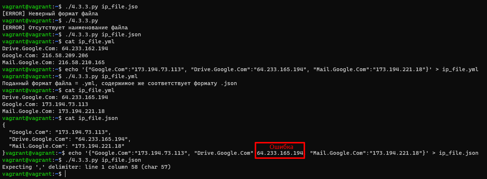

# Домашнее задание к занятию "4.3. Языки разметки JSON и YAML"


## Обязательная задача 1
Мы выгрузили JSON, который получили через API запрос к нашему сервису:
```json
{
  "info": "Sample JSON output from our service\t",
  "elements": [
    {
      "name": "first",
      "type": "server",
      "ip": 7175
    },
    {
      "name": "second",
      "type": "proxy",
      "ip": "71.78.22.43"
    }
  ]
}
```
  Нужно найти и исправить все ошибки, которые допускает наш сервис

## Обязательная задача 2
В прошлый рабочий день мы создавали скрипт, позволяющий опрашивать веб-сервисы и получать их IP. К уже реализованному функционалу нам нужно добавить возможность записи JSON и YAML файлов, описывающих наши сервисы. Формат записи JSON по одному сервису: `{ "имя сервиса" : "его IP"}`. Формат записи YAML по одному сервису: `- имя сервиса: его IP`. Если в момент исполнения скрипта меняется IP у сервиса - он должен так же поменяться в yml и json файле.

### Ваш скрипт:
```python
#!/usr/bin/env python3

import socket
import time
import json
import yaml
import datetime

with open("ip_file.json", "r") as read_file:
  ip_file = json.load(read_file)

while True:
  time.sleep(3)
  for key, value in ip_file.items():
    ip = socket.gethostbyname(key)
    if (ip != value):
      now = datetime.datetime.now()
      print(f'{str(now)}: [ERROR] {key} IP mismatch: {value} {ip}')
      ip_file[key] = ip
      with open("ip_file.json", "w") as write_file:
        json.dump(ip_file, write_file, indent=2)
      format_yml = []
      for key in ip_file:
        format_yml.append({key: ip_file[key]})
      with open("ip_file.yml", "w") as wf:
        yaml.dump(format_yml, wf, indent=2)
```

### Вывод скрипта при запуске при тестировании:
```
vagrant@vagrant:~$ vagrant@vagrant:~$ ./4.2.4.py
2022-01-30 16:46:13.936837: [ERROR] google.com IP mismatch: 173.194.222.138 173.194.222.100
2022-01-30 16:46:13.950816: [ERROR] mail.google.com IP mismatch: 173.194.222.19 64.233.165.18
2022-01-30 16:46:16.955042: [ERROR] google.com IP mismatch: 173.194.222.100 173.194.222.101
2022-01-30 16:46:44.010860: [ERROR] mail.google.com IP mismatch: 64.233.165.18 64.233.165.17
2022-01-30 16:46:47.015428: [ERROR] google.com IP mismatch: 173.194.222.101 173.194.222.102
```

### json-файл(ы), который(е) записал ваш скрипт:
```json
{
  "google.com": "173.194.222.102",
  "drive.google.com": "64.233.165.194",
  "mail.google.com": "64.233.165.17"
}
```

### yml-файл(ы), который(е) записал ваш скрипт:
```yaml
- google.com: 173.194.222.102
- drive.google.com: 64.233.165.194
- mail.google.com: 64.233.165.17
```

## Дополнительное задание (со звездочкой*) - необязательно к выполнению

Так как команды в нашей компании никак не могут прийти к единому мнению о том, какой формат разметки данных использовать: JSON или YAML, нам нужно реализовать парсер из одного формата в другой. Он должен уметь:
   * Принимать на вход имя файла
   * Проверять формат исходного файла. Если файл не json или yml - скрипт должен остановить свою работу
   * Распознавать какой формат данных в файле. Считается, что файлы *.json и *.yml могут быть перепутаны
   * Перекодировать данные из исходного формата во второй доступный (из JSON в YAML, из YAML в JSON)
   * При обнаружении ошибки в исходном файле - указать в стандартном выводе строку с ошибкой синтаксиса и её номер
   * Полученный файл должен иметь имя исходного файла, разница в наименовании обеспечивается разницей расширения файлов

### Ваш скрипт:
```python
#!/usr/bin/env python3

import json
import yaml
import sys
import re

try:
  sys.argv[1]
except:
  print("[ERROR] Отсутствует наименование файла")
  sys.exit()

pattern = r'\.json$|\.yml$'
format = re.findall(pattern, sys.argv[1])
if len(format) == 0:
  print("[ERROR] Неверный формат файла")
  sys.exit()
format = format[0]
name = re.sub(pattern, '', sys.argv[1])

with open(sys.argv[1], 'r') as r_file:
  file = r_file.read()

if re.findall('(\S|\w).*', file)[0] == '{':
  real_format_file = '.json'
else:
  real_format_file = '.yml'

if real_format_file != format:
  print(f"Поданный формат файла = {format}, содержимое же соответствует формату {real_format_file}")

if real_format_file == '.json':
  try:
    with open(sys.argv[1], 'r') as rf:
      jf = json.load(rf)
  except ValueError as e:
    print(e)
    sys.exit()
  with open(f'{name}.json', 'w') as wf:
    json.dump(jf, wf, indent=2)
  with open(f'{name}.yml', 'w') as wf:
    yaml.dump(jf, wf, indent=2)
else:
  try:
    with open(sys.argv[1], 'r') as rf:
      yf = yaml.safe_load(rf)
  except ValueError as e:
    print(e)
    sys.exit()
  with open(f'{name}.json', 'w') as wf:
    json.dump(yf, wf, indent=2)
  with open(f'{name}.yml', 'w') as wf:
    yaml.dump(yf, wf, indent=2)
```

### Пример работы скрипта:
> 
