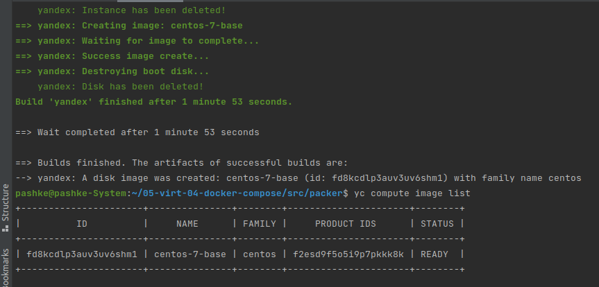
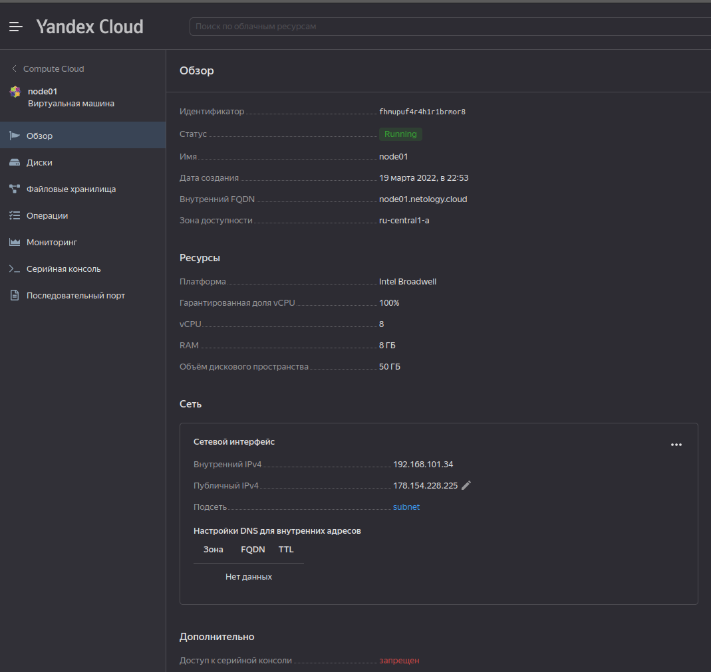
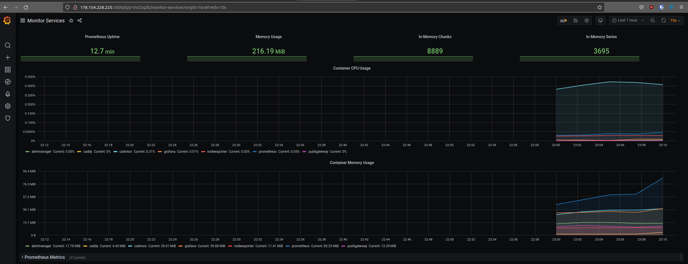

# Домашнее задание к занятию "5.4. Оркестрация группой Docker контейнеров на примере Docker Compose"

## Задача 1

Создать собственный образ операционной системы с помощью Packer.

Для получения зачета, вам необходимо предоставить:
- Скриншот страницы, как на слайде из презентации (слайд 37).

>    
> Часть для себя.
> ```shell
> # установка yc, работать он будет в новом окне терминала
> $ curl https://storage.yandexcloud.net/yandexcloud-yc/install.sh | bash
> # авторизация, после выполнения команды переходим по ссылке и после полученный токен вставляем в терминал
> $ yc init
> # создаем новую директорию netology
> [2] Create a new folder
> # выбираем зону доступности
> [1] ru-central1-a
> # создание новой сети 
> $ yc vpc network create --name net --labels my-label=netology --description "my first network via yc"
> # создание подсети
> $ yc vpc subnet create --name my-subnet-a --zone ru-central1-a --range 10.1.2.0/24 --network-name net --description "my first subnet via yc"
> ```
> Новую версию packer скачать можно с облака яндекса (https://hashicorp-releases.website.yandexcloud.net/packer/)  
> Скаченный файл разархивировал и закинул по пути /usr/bin/  
> ```shell
> # в centos-7-base.json прописать параметры своего облака
> # проверить сформированный файл
> $ packer validate centos-7-base.json
> The configuration is valid.
> # создать образ
> $ packer build centos-7-base.json
> # удалить сеть и подсеть
> $ yc vpc subnet delete --name my-subnet-a && yc vpc network delete --name net
> ```

## Задача 2

Создать вашу первую виртуальную машину в Яндекс.Облаке.

Для получения зачета, вам необходимо предоставить:
- Скриншот страницы свойств созданной ВМ, как на примере ниже:

<p align="center">
  
</p>

>    
> Часть для себя.  
> Т.к. terraform заблокирован, можно скачать его с облака яндекса. В provider.tf надо изменить источник на source 
> "terraform-registry.storage.yandexcloud.net/yandex-cloud/yandex" (https://cloud.yandex.ru/docs/tutorials/infrastructure-management/terraform-quickstart)
> ```shell
> #просмотр сервисных аккаунтов в директории netology
> $ yc iam service-account --folder-id b1geflh3fie15cuetkpj list
> #создание сервисного аккаунта
> $ yc iam service-account create --folder-id b1geflh3fie15cuetkpj --name my-robot
> # добавил через web консоль роль администратора созданному аккаунту
> #создание авторизованного ключа для сервисного пользователя и сохранение его в файл key.json
> $ yc iam key create --service-account-name my-robot --output key.json
> # проверка плана terraform
> $ terraform plan 
> # применение terraform плана (авто подтверждение действий -auto-approve)
> $ terraform apply -auto-approve
> # при ошибке стоит удалить созданные объекты, чтоб заново начать с чистого листа
> $ terraform destroy -auto-approve
> ```

## Задача 3

Создать ваш первый готовый к боевой эксплуатации компонент мониторинга, состоящий из стека микросервисов.

Для получения зачета, вам необходимо предоставить:
- Скриншот работающего веб-интерфейса Grafana с текущими метриками, как на примере ниже
<p align="center">
  
</p>

>    
> Для себя. 
> ```shell
> # сразу не взлетело, пришлось поправить права на директорию ansible
> $ sudo chmod 755 ../ansible
> # также пришлось пересоздать ключ, не получалось подключиться. Для это удалил ключи, которые были, выполнил 
> # terraform destroy и заново terraform apply
> $ ssh-keygen -t rsa -b 2048
> # подготовка ПО и запуск стека микросервисов
> $ ansible-playbook provision.yml
> ```

## Задача 4 (*)

Создать вторую ВМ и подключить её к мониторингу развёрнутому на первом сервере.

Для получения зачета, вам необходимо предоставить:
- Скриншот из Grafana, на котором будут отображаться метрики добавленного вами сервера.

