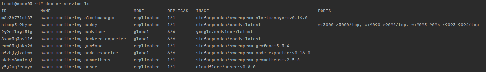

# Домашнее задание к занятию "5.5. Оркестрация кластером Docker контейнеров на примере Docker Swarm"

## Задача 1

Дайте письменые ответы на следующие вопросы:

- В чём отличие режимов работы сервисов в Docker Swarm кластере: replication и global?
> В режиме replication указываем сколько сервисов необходимо запустить и столько будет запущено.  
> В режиме global для каждой ноды будет запущен один сервис. При добавлении новой ноды будет запущен и новый сервис.
- Какой алгоритм выбора лидера используется в Docker Swarm кластере?
> Алгоритм поддержания распределенного консенсуса — [Raft](https://raft.github.io/).  
> Для обеспечения консенсуса в Raft сначала выбирается лидер, на котором будет лежать ответственность за управление 
> распределённым логом. Лидер принимает запросы от клиентов и реплицирует их на остальные сервера в кластере. В случае 
> выхода лидера из строя, в кластере будет выбран новый лидер. [habr](https://habr.com/ru/company/dododev/blog/469999/)
- Что такое Overlay Network?
> Общий случай логической сети, создаваемой поверх другой сети. Позволяет быстро и безопасно обмениваться пакетами между нодами ( 
> [wikipedia](https://ru.wikipedia.org/wiki/%D0%9E%D0%B2%D0%B5%D1%80%D0%BB%D0%B5%D0%B9%D0%BD%D0%B0%D1%8F_%D1%81%D0%B5%D1%82%D1%8C), 
> [docker](https://docs.docker.com/network/overlay/) )

## Задача 2

Создать ваш первый Docker Swarm кластер в Яндекс.Облаке

Для получения зачета, вам необходимо предоставить скриншот из терминала (консоли), с выводом команды:
```
docker node ls
```
> 
## Задача 3

Создать ваш первый, готовый к боевой эксплуатации кластер мониторинга, состоящий из стека микросервисов.

Для получения зачета, вам необходимо предоставить скриншот из терминала (консоли), с выводом команды:
```
docker service ls
```
> 
## Задача 4 (*)

Выполнить на лидере Docker Swarm кластера команду (указанную ниже) и дать письменное описание её функционала, что она делает и зачем она нужна:
```
# см.документацию: https://docs.docker.com/engine/swarm/swarm_manager_locking/
docker swarm update --autolock=true
```
> 
> Насколько понял, без включения этой команды, при перезапуске докера можно скомпрометировать ключи, используемые для 
> связи между нодами и для доступа до логов, так как они загружаются в оперативную память в незашифрованном виде на
> каждой ноду. Использование этой команды дополнительно шифрует ключи.