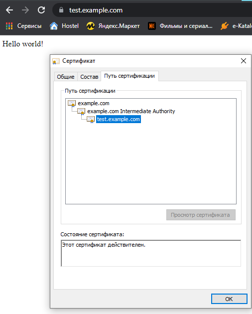

# Курсовая работа по итогам модуля "DevOps и системное администрирование"

Курсовая работа необходима для проверки практических навыков, полученных в ходе прохождения курса "DevOps и системное администрирование".

Мы создадим и настроим виртуальное рабочее место. Позже вы сможете использовать эту систему для выполнения домашних заданий по курсу

## Задание

1. Создайте виртуальную машину Linux.
2. Установите ufw и разрешите к этой машине сессии на порты 22 и 443, при этом трафик на интерфейсе localhost (lo) должен ходить свободно на все порты.
3. Установите hashicorp vault ([инструкция по ссылке](https://learn.hashicorp.com/tutorials/vault/getting-started-install?in=vault/getting-started#install-vault)).
4. Cоздайте центр сертификации по инструкции ([ссылка](https://learn.hashicorp.com/tutorials/vault/pki-engine?in=vault/secrets-management)) и выпустите сертификат для использования его в настройке веб-сервера nginx (срок жизни сертификата - месяц).
5. Установите корневой сертификат созданного центра сертификации в доверенные в хостовой системе.
6. Установите nginx.
7. По инструкции ([ссылка](https://nginx.org/en/docs/http/configuring_https_servers.html)) настройте nginx на https, используя ранее подготовленный сертификат:
  - можно использовать стандартную стартовую страницу nginx для демонстрации работы сервера;
  - можно использовать и другой html файл, сделанный вами;
8. Откройте в браузере на хосте https адрес страницы, которую обслуживает сервер nginx.
9. Создайте скрипт, который будет генерировать новый сертификат в vault:
  - генерируем новый сертификат так, чтобы не переписывать конфиг nginx;
  - перезапускаем nginx для применения нового сертификата.
10. Поместите скрипт в crontab, чтобы сертификат обновлялся какого-то числа каждого месяца в удобное для вас время.

## Результат

Результатом курсовой работы должны быть снимки экрана или текст:

- Процесс установки и настройки ufw
```shell
#установка ufw
sudo apt install ufw
#включить firewall:
sudo ufw enable
#открыть порты для входящих подключений:
sudo ufw allow 443/tcp
sudo ufw allow 22/tcp
#разрешить соединение ко всем портам сервера с конкретного IP-адреса:
sudo ufw allow from 127.0.0.1
#текущий статус и вывод правил:
vagrant@vagrant:~$ sudo ufw status verbose
Status: active
Logging: on (low)
Default: deny (incoming), allow (outgoing), disabled (routed)
New profiles: skip

To                         Action      From
--                         ------      ----
443/tcp                    ALLOW IN    Anywhere
Anywhere                   ALLOW IN    127.0.0.1
22/tcp                     ALLOW IN    Anywhere
443/tcp (v6)               ALLOW IN    Anywhere (v6)
22/tcp (v6)                ALLOW IN    Anywhere (v6)
```
- Процесс установки и выпуска сертификата с помощью hashicorp vault
```shell
#в отдельной сессии запускаем vault
vagrant@vagrant:~$ vault server -dev -dev-root-token-id root
==> Vault server configuration:

             Api Address: http://127.0.0.1:8200
                     Cgo: disabled
         Cluster Address: https://127.0.0.1:8201
              Go Version: go1.17.5
              Listener 1: tcp (addr: "127.0.0.1:8200", cluster address: "127.0.0.1:8201", max_request_duration: "1m30s", max_request_size: "33554432", tls: "disabled")
               Log Level: info
                   Mlock: supported: true, enabled: false
           Recovery Mode: false
                 Storage: inmem
                 Version: Vault v1.9.3
             Version Sha: 7dbdd57243a0d8d9d9e07cd01eb657369f8e1b8a

==> Vault server started! Log data will stream in below:

2022-02-05T07:45:05.972Z [INFO]  proxy environment: http_proxy="\"\"" https_proxy="\"\"" no_proxy="\"\""
2022-02-05T07:45:05.973Z [WARN]  no `api_addr` value specified in config or in VAULT_API_ADDR; falling back to detection if possible, but this value should be manually set
2022-02-05T07:45:05.975Z [INFO]  core: Initializing VersionTimestamps for core
2022-02-05T07:45:05.976Z [INFO]  core: security barrier not initialized
2022-02-05T07:45:05.977Z [INFO]  core: security barrier initialized: stored=1 shares=1 threshold=1
2022-02-05T07:45:05.979Z [INFO]  core: post-unseal setup starting
2022-02-05T07:45:05.981Z [INFO]  core: loaded wrapping token key
2022-02-05T07:45:05.981Z [INFO]  core: Recorded vault version: vault version=1.9.3 upgrade time="2022-02-05 07:45:05.9818768 +0000 UTC m=+0.256594534"
2022-02-05T07:45:05.982Z [INFO]  core: successfully setup plugin catalog: plugin-directory="\"\""
2022-02-05T07:45:05.982Z [INFO]  core: no mounts; adding default mount table
2022-02-05T07:45:05.989Z [INFO]  core: successfully mounted backend: type=cubbyhole path=cubbyhole/
2022-02-05T07:45:05.990Z [INFO]  core: successfully mounted backend: type=system path=sys/
2022-02-05T07:45:05.991Z [INFO]  core: successfully mounted backend: type=identity path=identity/
2022-02-05T07:45:05.995Z [INFO]  core: successfully enabled credential backend: type=token path=token/
2022-02-05T07:45:05.995Z [INFO]  rollback: starting rollback manager
2022-02-05T07:45:05.995Z [INFO]  core: restoring leases
2022-02-05T07:45:05.996Z [INFO]  expiration: lease restore complete
2022-02-05T07:45:05.996Z [INFO]  identity: entities restored
2022-02-05T07:45:05.996Z [INFO]  identity: groups restored
2022-02-05T07:45:05.997Z [INFO]  core: post-unseal setup complete
2022-02-05T07:45:05.997Z [INFO]  core: root token generated
2022-02-05T07:45:05.997Z [INFO]  core: pre-seal teardown starting
2022-02-05T07:45:05.997Z [INFO]  rollback: stopping rollback manager
2022-02-05T07:45:05.997Z [INFO]  core: pre-seal teardown complete
2022-02-05T07:45:05.997Z [INFO]  core.cluster-listener.tcp: starting listener: listener_address=127.0.0.1:8201
2022-02-05T07:45:05.997Z [INFO]  core.cluster-listener: serving cluster requests: cluster_listen_address=127.0.0.1:8201
2022-02-05T07:45:05.998Z [INFO]  core: post-unseal setup starting
2022-02-05T07:45:05.998Z [INFO]  core: loaded wrapping token key
2022-02-05T07:45:05.998Z [INFO]  core: successfully setup plugin catalog: plugin-directory="\"\""
2022-02-05T07:45:05.998Z [INFO]  core: successfully mounted backend: type=system path=sys/
2022-02-05T07:45:05.999Z [INFO]  core: successfully mounted backend: type=identity path=identity/
2022-02-05T07:45:05.999Z [INFO]  core: successfully mounted backend: type=cubbyhole path=cubbyhole/
2022-02-05T07:45:06.000Z [INFO]  core: successfully enabled credential backend: type=token path=token/
2022-02-05T07:45:06.001Z [INFO]  rollback: starting rollback manager
2022-02-05T07:45:06.001Z [INFO]  core: restoring leases
2022-02-05T07:45:06.001Z [INFO]  identity: entities restored
2022-02-05T07:45:06.001Z [INFO]  identity: groups restored
2022-02-05T07:45:06.001Z [INFO]  expiration: lease restore complete
2022-02-05T07:45:06.001Z [INFO]  core: post-unseal setup complete
2022-02-05T07:45:06.001Z [INFO]  core: vault is unsealed
2022-02-05T07:45:06.002Z [INFO]  expiration: revoked lease: lease_id=auth/token/root/hb82660ea0e87b51ba8b363f721e09cb636d37d55c982785d9c36720d43990dcf
2022-02-05T07:45:06.005Z [INFO]  core: successful mount: namespace="\"\"" path=secret/ type=kv
2022-02-05T07:45:06.015Z [INFO]  secrets.kv.kv_46ec5e67: collecting keys to upgrade
2022-02-05T07:45:06.015Z [INFO]  secrets.kv.kv_46ec5e67: done collecting keys: num_keys=1
2022-02-05T07:45:06.015Z [INFO]  secrets.kv.kv_46ec5e67: upgrading keys finished
WARNING! dev mode is enabled! In this mode, Vault runs entirely in-memory
and starts unsealed with a single unseal key. The root token is already
authenticated to the CLI, so you can immediately begin using Vault.

You may need to set the following environment variable:

    $ export VAULT_ADDR='http://127.0.0.1:8200'

The unseal key and root token are displayed below in case you want to
seal/unseal the Vault or re-authenticate.

Unseal Key: RE+8HqlxDSnknXNQrXyzd4lplfsg6RvF10dOzLmmQcg=
Root Token: root

Development mode should NOT be used in production installations!
```
```shell
#первоначальные настройки vault
vagrant@vagrant:~$ export VAULT_ADDR=http://127.0.0.1:8200
vagrant@vagrant:~$ export VAULT_TOKEN=root
#генерируем корневой сертификат
#pki в vault для корневых сертификатов
vagrant@vagrant:~$ vault secrets enable pki
Success! Enabled the pki secrets engine at: pki/
#установили максимальный срок действия сертификатов 
vagrant@vagrant:~$ vault secrets tune -max-lease-ttl=87600h pki
Success! Tuned the secrets engine at: pki/
#генерация корневого сертификата (root CA)
vagrant@vagrant:~$ vault write -field=certificate pki/root/generate/internal \
>      common_name="example.com" \
>      ttl=87600h > CA_cert.crt
#вроде как определяем пути сохранения сертификатов?
vagrant@vagrant:~$ vault write pki/config/urls \
>      issuing_certificates="$VAULT_ADDR/v1/pki/ca" \
>      crl_distribution_points="$VAULT_ADDR/v1/pki/crl"
Success! Data written to: pki/config/urls
```
```shell
#создание промежуточного сертификата (intermediate CA)
#pki в vault для промежуточных сертификатов 
vagrant@vagrant:~$ vault secrets enable -path=pki_int pki
Success! Enabled the pki secrets engine at: pki_int/
#срок действия для промежуточных сертификатов
vagrant@vagrant:~$ vault secrets tune -max-lease-ttl=43800h pki_int
Success! Tuned the secrets engine at: pki_int/
#создание промежуточного сертификата
vagrant@vagrant:~$ vault write -format=json pki_int/intermediate/generate/internal \
>      common_name="example.com Intermediate Authority" \
>      | jq -r '.data.csr' > pki_intermediate.csr
#подписать промежуточный сертификат корневым
vagrant@vagrant:~$ vault write -format=json pki/root/sign-intermediate csr=@pki_intermediate.csr \
>      format=pem_bundle ttl="43800h" \
>      | jq -r '.data.certificate' > intermediate.cert.pem
#после того как сертификат подписан, сохраняем его в vault?
vagrant@vagrant:~$ vault write pki_int/intermediate/set-signed certificate=@intermediate.cert.pem
Success! Data written to: pki_int/intermediate/set-signed
```
```shell
#оставить описание
vagrant@vagrant:~$ vault write pki_int/roles/example-dot-com \
>      allowed_domains="example.com" \
>      allow_subdomains=true \
>      max_ttl="720h"
Success! Data written to: pki_int/roles/example-dot-com
#создание сертификата сервера сроком жизни 30 дней
vagrant@vagrant:~$ vault write -format=json pki_int/issue/example-dot-com \
>   common_name="test.example.com" \
>   ttl="720h" > test.crt
#сохранение pem и key
vagrant@vagrant:~$ cat test.crt | jq -r .data.certificate > vault.test.example.com.crt.pem
vagrant@vagrant:~$ cat test.crt | jq -r .data.ca_chain[0] >> vault.test.example.com.crt.pem
vagrant@vagrant:~$ cat test.crt | jq -r .data.private_key > vault.test.example.com.crt.key
```
> Также корневой сертификат CA_cert.crt добавлен в windows в сертификаты (MMC)
- Процесс установки и настройки сервера nginx
```shell
#использовалась инструкция https://nginx.org/ru/linux_packages.html
#Установил пакеты, необходимые для подключения apt-репозитория
vagrant@vagrant:~$ sudo apt install curl gnupg2 ca-certificates lsb-release ubuntu-keyring
Reading package lists... Done
Building dependency tree
Reading state information... Done
lsb-release is already the newest version (11.1.0ubuntu2).
lsb-release set to manually installed.
ubuntu-keyring is already the newest version (2020.02.11.4).
The following additional packages will be installed:
  libcurl4
The following NEW packages will be installed:
  gnupg2
The following packages will be upgraded:
  ca-certificates curl libcurl4
3 upgraded, 1 newly installed, 0 to remove and 109 not upgraded.
Need to get 546 kB of archives.
After this operation, 52.2 kB of additional disk space will be used.
Do you want to continue? [Y/n] y
Get:1 http://archive.ubuntu.com/ubuntu focal-updates/main amd64 ca-certificates all 20210119~20.04.2 [145 kB]
Get:2 http://archive.ubuntu.com/ubuntu focal-updates/main amd64 curl amd64 7.68.0-1ubuntu2.7 [161 kB]
Get:3 http://archive.ubuntu.com/ubuntu focal-updates/main amd64 libcurl4 amd64 7.68.0-1ubuntu2.7 [234 kB]
Get:4 http://archive.ubuntu.com/ubuntu focal-updates/universe amd64 gnupg2 all 2.2.19-3ubuntu2.1 [4,584 B]
Fetched 546 kB in 1s (429 kB/s)
Preconfiguring packages ...
(Reading database ... 41575 files and directories currently installed.)
Preparing to unpack .../ca-certificates_20210119~20.04.2_all.deb ...
Unpacking ca-certificates (20210119~20.04.2) over (20210119~20.04.1) ...
Preparing to unpack .../curl_7.68.0-1ubuntu2.7_amd64.deb ...
Unpacking curl (7.68.0-1ubuntu2.7) over (7.68.0-1ubuntu2.6) ...
Preparing to unpack .../libcurl4_7.68.0-1ubuntu2.7_amd64.deb ...
Unpacking libcurl4:amd64 (7.68.0-1ubuntu2.7) over (7.68.0-1ubuntu2.6) ...
Selecting previously unselected package gnupg2.
Preparing to unpack .../gnupg2_2.2.19-3ubuntu2.1_all.deb ...
Unpacking gnupg2 (2.2.19-3ubuntu2.1) ...
Setting up gnupg2 (2.2.19-3ubuntu2.1) ...
Setting up ca-certificates (20210119~20.04.2) ...
Updating certificates in /etc/ssl/certs...
0 added, 1 removed; done.
Setting up libcurl4:amd64 (7.68.0-1ubuntu2.7) ...
Setting up curl (7.68.0-1ubuntu2.7) ...
Processing triggers for man-db (2.9.1-1) ...
Processing triggers for libc-bin (2.31-0ubuntu9.2) ...
Processing triggers for ca-certificates (20210119~20.04.2) ...
Updating certificates in /etc/ssl/certs...
0 added, 0 removed; done.
Running hooks in /etc/ca-certificates/update.d...
done.
#импортировал официальный ключ, используемый apt для проверки подлинности пакетов
vagrant@vagrant:~$ curl https://nginx.org/keys/nginx_signing.key | gpg --dearmor \
>     | sudo tee /usr/share/keyrings/nginx-archive-keyring.gpg >/dev/null
  % Total    % Received % Xferd  Average Speed   Time    Time     Time  Current
                                 Dload  Upload   Total   Spent    Left  Speed
100  1561  100  1561    0     0   3335      0 --:--:-- --:--:-- --:--:--  3335
#Проверка, верный ли ключ был загружен. Вывод команды должен содержать полный отпечаток ключа 573BFD6B3D8FBC641079A6ABABF5BD827BD9BF62
vagrant@vagrant:~$ gpg --dry-run --quiet --import --import-options import-show /usr/share/keyrings/nginx-archive-keyring.gpg
gpg: keyblock resource '/home/vagrant/.gnupg/pubring.kbx': No such file or directory
pub   rsa2048 2011-08-19 [SC] [expires: 2024-06-14]
      573BFD6B3D8FBC641079A6ABABF5BD827BD9BF62
uid                      nginx signing key <signing-key@nginx.com>
#Для подключения apt-репозитория для стабильной версии nginx, выполнил следующую команду:
vagrant@vagrant:~$ echo "deb [signed-by=/usr/share/keyrings/nginx-archive-keyring.gpg] \
> http://nginx.org/packages/ubuntu `lsb_release -cs` nginx" \
>     | sudo tee /etc/apt/sources.list.d/nginx.list
deb [signed-by=/usr/share/keyrings/nginx-archive-keyring.gpg] http://nginx.org/packages/ubuntu focal nginx
#Для использования пакетов из нашего репозитория вместо распространяемых в дистрибутиве, настройте закрепление:
vagrant@vagrant:~$ echo -e "Package: *\nPin: origin nginx.org\nPin: release o=nginx\nPin-Priority: 900\n" \
>     | sudo tee /etc/apt/preferences.d/99nginx
Package: *
Pin: origin nginx.org
Pin: release o=nginx
Pin-Priority: 900
#Обновляем списки пакетов
vagrant@vagrant:~$ sudo apt update
Hit:1 http://archive.ubuntu.com/ubuntu focal InRelease
Get:2 http://nginx.org/packages/ubuntu focal InRelease [3,584 B]
Get:3 http://archive.ubuntu.com/ubuntu focal-updates InRelease [114 kB]
Get:4 http://security.ubuntu.com/ubuntu focal-security InRelease [114 kB]
Get:5 http://nginx.org/packages/ubuntu focal/nginx amd64 Packages [15.7 kB]
Get:6 https://apt.releases.hashicorp.com focal InRelease [9,495 B]
Get:7 http://archive.ubuntu.com/ubuntu focal-backports InRelease [108 kB]
Get:8 https://apt.releases.hashicorp.com focal/main amd64 Packages [47.4 kB]
Get:9 http://archive.ubuntu.com/ubuntu focal-updates/main i386 Packages [597 kB]
Get:10 http://security.ubuntu.com/ubuntu focal-security/main amd64 Packages [1,210 kB]
Get:11 http://archive.ubuntu.com/ubuntu focal-updates/main amd64 Packages [1,550 kB]
Get:12 http://archive.ubuntu.com/ubuntu focal-updates/universe amd64 Packages [896 kB]
Get:13 http://security.ubuntu.com/ubuntu focal-security/main i386 Packages [367 kB]
Get:14 http://archive.ubuntu.com/ubuntu focal-updates/universe i386 Packages [665 kB]
Get:15 http://security.ubuntu.com/ubuntu focal-security/main Translation-en [213 kB]
Get:16 http://security.ubuntu.com/ubuntu focal-security/universe i386 Packages [532 kB]
Get:17 http://security.ubuntu.com/ubuntu focal-security/universe amd64 Packages [676 kB]
Fetched 7,120 kB in 10s (730 kB/s)
Reading package lists... Done
Building dependency tree
Reading state information... Done
109 packages can be upgraded. Run 'apt list --upgradable' to see them.
N: Skipping acquire of configured file 'nginx/binary-i386/Packages' as repository 'http://nginx.org/packages/ubuntu focal InRelease' doesn\'t support architecture 'i386'
#Устанавливаем nginx
vagrant@vagrant:~$ sudo apt install nginx
Reading package lists... Done
Building dependency tree
Reading state information... Done
The following NEW packages will be installed:
  nginx
0 upgraded, 1 newly installed, 0 to remove and 109 not upgraded.
Need to get 879 kB of archives.
After this operation, 3,117 kB of additional disk space will be used.
Get:1 http://nginx.org/packages/ubuntu focal/nginx amd64 nginx amd64 1.20.2-1~focal [879 kB]
Fetched 879 kB in 1s (611 kB/s)
Selecting previously unselected package nginx.
(Reading database ... 41580 files and directories currently installed.)
Preparing to unpack .../nginx_1.20.2-1~focal_amd64.deb ...
----------------------------------------------------------------------

Thanks for using nginx!

Please find the official documentation for nginx here:
* https://nginx.org/en/docs/

Please subscribe to nginx-announce mailing list to get
the most important news about nginx:
* https://nginx.org/en/support.html

Commercial subscriptions for nginx are available on:
* https://nginx.com/products/

----------------------------------------------------------------------
Unpacking nginx (1.20.2-1~focal) ...
Setting up nginx (1.20.2-1~focal) ...
Created symlink /etc/systemd/system/multi-user.target.wants/nginx.service → /lib/systemd/system/nginx.service.
Processing triggers for man-db (2.9.1-1) ...
Processing triggers for systemd (245.4-4ubuntu3.11)
```
```shell
#директория, куда сохранил сертификат и ключ
vagrant@vagrant:~$ sudo mkdir /etc/nginx/conf
vagrant@vagrant:~$ sudo cp vault.test.example.com.crt.pem /etc/nginx/conf/
vagrant@vagrant:~$ sudo cp vault.test.example.com.crt.key /etc/nginx/conf/
#создал директорию, куда выложу стартовую страницу
vagrant@vagrant:~$ sudo mkdir /data
vagrant@vagrant:~$ sudo chown vagrant /data
vagrant@vagrant:~$ mkdir /data/www
vagrant@vagrant:~$ echo 'Hello world!' > /data/www/index.html
#файл конфигурации nginx
vagrant@vagrant:~$ sudo nano /etc/nginx/nginx.conf
```
```shell
user  nginx;
worker_processes  auto;

error_log  /var/log/nginx/error.log notice;
pid        /var/run/nginx.pid;


events {
    worker_connections  1024;
}


http {
    include       /etc/nginx/mime.types;
    default_type  application/octet-stream;

    log_format  main  '$remote_addr - $remote_user [$time_local] "$request" '
                      '$status $body_bytes_sent "$http_referer" '
                      '"$http_user_agent" "$http_x_forwarded_for"';

    access_log  /var/log/nginx/access.log  main;

    sendfile        on;
    #tcp_nopush     on;

    keepalive_timeout  65;

    #gzip  on;

    include /etc/nginx/conf.d/*.conf;

    server {
        location / {
            root /data/www;
        }
        listen              443 ssl;
        server_name         test.example.com;
        ssl_certificate     /etc/nginx/conf/vault.test.example.com.crt.pem;
        ssl_certificate_key /etc/nginx/conf/vault.test.example.com.crt.key;
        ssl_protocols       TLSv1 TLSv1.1 TLSv1.2;
        ssl_ciphers         HIGH:!aNULL:!MD5;
    }
}
```
```shell
#запуск nginx
vagrant@vagrant:~$ service nginx start
==== AUTHENTICATING FOR org.freedesktop.systemd1.manage-units ===
Authentication is required to start 'nginx.service'.
Authenticating as: vagrant,,, (vagrant)
Password:
==== AUTHENTICATION COMPLETE ===
```
> в hosts на win и linux прописал test.example.com для ip 127.0.0.2
- Страница сервера nginx в браузере хоста не содержит предупреждений 
> 
- Скрипт генерации нового сертификата работает (сертификат сервера ngnix должен быть "зеленым")
```shell
#дать права на директорию с сертификатами пользователю vagrant
vagrant@vagrant:~$ sudo chown vagrant /etc/nginx/conf
```
```shell
#файл для генерации нового сертификата:
export VAULT_ADDR='http://127.0.0.1:8200'
vault write -format=json pki_int/issue/example-dot-com \
   common_name="test.example.com" \
   ttl="720h" > /home/vagrant/test.crt
cat /home/vagrant/test.crt | jq -r .data.certificate > /etc/nginx/conf/vault.test.example.com.crt.pem
cat /home/vagrant/test.crt | jq -r .data.ca_chain[0] >> /etc/nginx/conf/vault.test.example.com.crt.pem
cat /home/vagrant/test.crt | jq -r .data.private_key > /etc/nginx/conf/vault.test.example.com.crt.key
```
- Crontab работает (выберите число и время так, чтобы показать что crontab запускается и делает что надо)
```shell
vagrant@vagrant:~$ crontab -e
```
> SHELL=/bin/bash  
> 28 20 5 * * /home/vagrant/new_cer >> /home/vagrant/log 2>&1
```shell
vagrant@vagrant:~$ sudo crontab -e
```
> 29 20 5 * * sudo nginx -s reload
```shell
vagrant@vagrant:~$ grep CRON /var/log/syslog
...
Feb  5 20:28:01 vagrant CRON[9094]: (vagrant) CMD (/home/vagrant/new_cer >> /home/vagrant/log 2>&1)
Feb  5 20:29:01 vagrant CRON[9110]: (root) CMD (sudo nginx -s reload)
```
> пересоздались файлы с сертификатами и под новыми pid запущены процессы nginx
```shell
vagrant@vagrant:~$ ps -ax | grep nginx
   8399 ?        Ss     0:00 nginx: master process /usr/sbin/nginx -c /etc/nginx/nginx.conf
   9113 ?        S      0:00 nginx: worker process
   9114 ?        S      0:00 nginx: worker process
   9133 pts/2    S+     0:00 grep --color=auto nginx
vagrant@vagrant:~$ ls -l /etc/nginx/conf/
total 8
-rw-r--r-- 1 vagrant root 1679 Feb  5 20:28 vault.test.example.com.crt.key
-rw-r--r-- 1 vagrant root 2567 Feb  5 20:28 vault.test.example.com.crt.pem
```